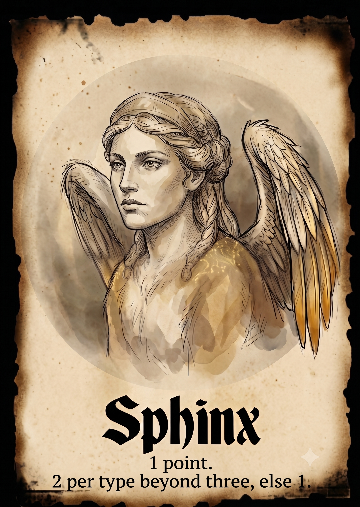

# Sphinx Score — Verification Suite

External acceptance suite for the `sphinx-score-{prose,user-story,example-mapping}`
kata family. The implementer never sees these scenarios during a run;
`analyze-run.sh` invokes them after the run completes and reports
`verification_pct`.

## Contract

- **Command**: `pnpm exec tsx src/cli.ts` (executed in the run directory)
- **Stdin**: JSON `{ "army": [ { "monster": "sphinx" }, { "monster": "undead-warrior", "rank": 1 }, … ] }`
- **Stdout**: JSON `{ "score": <integer> }` — the Sphinx points contributed
  by the army. Cards other than Sphinxes contribute no points of their
  own; they only matter as *types*.
- **Comparison**: canonical deep-equal via `jq -S .` on both sides.

The `rank` field carries the point variant of an Undead Warrior card
(1, 2 or 3). It is deliberately neutral: it does not say whether the
three variants count as one type or three. That is exactly ambiguity S2.

## The card



> **Sphinx** — 1 point. 2 per type beyond three, else 1.

Each Sphinx card is scored on its own, against the army around it. A
Sphinx scores 1 point, plus 2 points for every type past the third; if
the army holds no type past the third, it scores 1 point instead.

`card.png` is the printed card this kata is built from. It lives here
rather than next to a prompt on purpose: the prompts must carry the rule
as *text* only, so nothing competes with the neutral wording the
ambiguities depend on.

<br clear="right">

Design rationale, pinned readings and pre-test findings:
[`research/kata-design/overlords-mehrdeutigkeiten.md`](../../../research/kata-design/overlords-mehrdeutigkeiten.md).

## Pinned interpretations

The rule text in the prompts stays neutral — only the example-mapping
variant communicates these through examples.

| Axis | Question | Pinned |
|---|---|---|
| S1 | Does a Sphinx count itself as a type? | **Its own card does not count; other Sphinxes do** |
| S2 | Are the three Undead Warrior variants one type or three? | **One** type |
| S3 | "else 1" — once, or per type? | **Once** (flat) |

S1 follows from scoring each card against the rest of the army: from one
Sphinx's point of view, a second Sphinx is another monster in that army.
A lone Sphinx therefore sees no Sphinx type; two Sphinxes each see one.

## Scenarios

`disc.` lists which pinned readings a scenario would break if the
opposite were implemented — that is what makes it a pin rather than a
smoke test. `S1-none` = "a Sphinx never counts as a type",
`S1-all` = "a Sphinx counts itself too".

| NN | Army | Types seen | Score | disc. |
|----|------|-----------|-------|-------|
| 01 | chimera, orthrus (no Sphinx) | – | 0 | – |
| 02 | Sphinx alone | 0 | 2 | S3 |
| 03 | Sphinx + 2 types | 2 | 2 | S3 |
| 04 | Sphinx + 3 types | 3 | 2 | S1-all, S3 |
| 05 | Sphinx + 4 types | 4 | 3 | S1-all |
| 06 | Sphinx + 5 types | 5 | 5 | S1-all |
| 07 | Sphinx + 4 zombies + 3 hydras | 2 | 2 | S3 |
| 08 | Sphinx, UW 1/2/3, hydra | 2 | 2 | S2, S3 |
| 09 | Sphinx, UW 1/2/3, hydra, zombie | 3 | 2 | S1-all, S2, S3 |
| 10 | Sphinx, UW 1/2, + 4 more types | 5 | 5 | S1-all, S2 |
| 11 | 2 Sphinxes alone | 1 each | 4 | – |
| 12 | 2 Sphinxes + 2 types | 3 each | 4 | S3 |
| 13 | 2 Sphinxes + 3 types | 4 each | 6 | S1-none |
| 14 | 3 Sphinxes + 3 types | 4 each | 9 | S1-none |
| 15 | 2 Sphinxes + 5 types | 6 each | 14 | S1-none |

Scenario 13 is the sharpest S1 pin: three other types plus a second
Sphinx puts each Sphinx at four types, so both start scoring — 6 instead
of 4. Scenario 09 is the sharpest S2 pin: reading the three Undead
Warrior variants as three types would push the army to five types and
score 5 instead of 2.

Scenarios 01, 07 and 11 pin no ambiguity on their own; they guard the
base mechanics (no Sphinx → 0; types are counted, not cards; several
Sphinxes each score).

Every pinned reading is discriminated from both directions:

| Reading | Fails at |
|---|---|
| S1-none (Sphinx never a type) | 13, 14, 15 |
| S1-all (Sphinx counts itself) | 04, 05, 06, 09, 10 |
| S2 (UW variants = three types) | 08, 09, 10 |
| S3 ("else 1" per type) | 02, 03, 04, 07, 08, 09, 12 |

## Manual execution

```bash
for inp in scenarios/*.input.json; do
    name=$(basename "$inp" .input.json)
    exp="${inp%.input.json}.expected.json"
    actual=$(cd /path/to/run && pnpm exec tsx src/cli.ts < "$inp")
    diff <(echo "$actual" | jq -S .) <(jq -S . "$exp") >/dev/null \
        && echo "PASS: $name" || echo "FAIL: $name"
done
```
